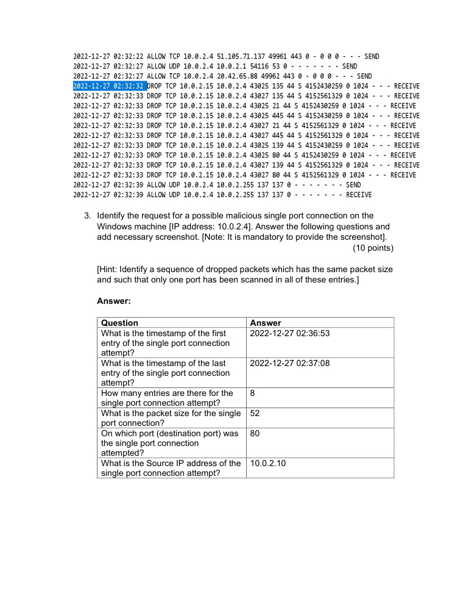
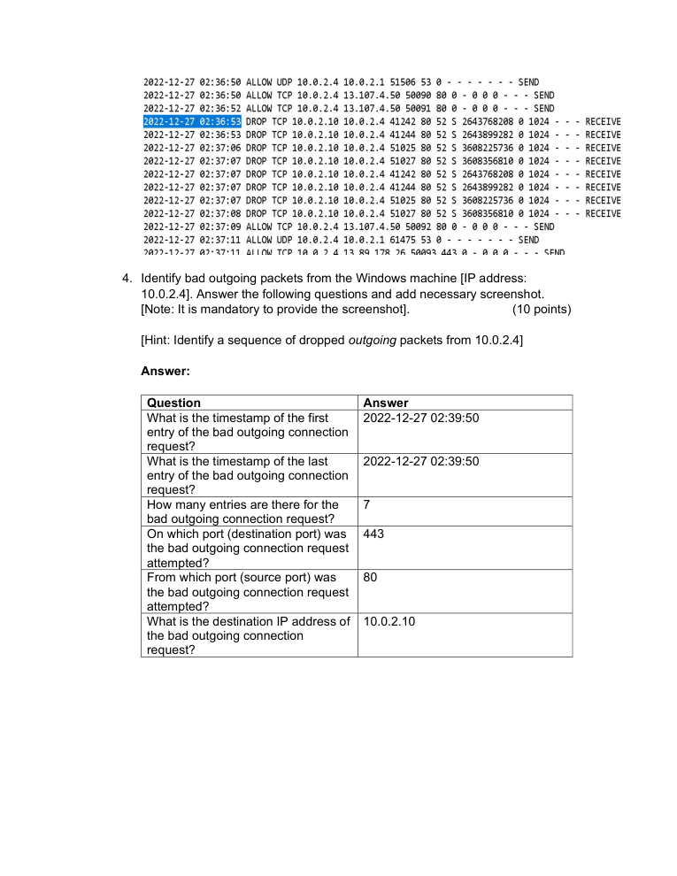

# Windows Firewall Log Analysis

> **SOC Analyst Portfolio Project**

## Overview
Analyzed Microsoft Windows Firewall logs to identify reconnaissance and suspicious connection activity.

**Category:** Network security monitoring / log analysis  
**Tools / Concepts:** Windows Firewall / firewall logs / TCP-IP

### 🧰 Tools
  

## What I Did
- Identified a 10-entry port-scanning sequence from 10.0.2.15.
- Observed destination ports 135, 21, 445, 139 and 80 in the scan sequence.
- Identified an 8-entry single-port connection attempt to destination port 80 from 10.0.2.10.
- Correlated timestamps, packet sizes, source IPs and destination ports.

## Evidence
The screenshots below were extracted/rendered from the original project submission. Public-facing evidence has been kept focused on the security-analysis workflow; credential values are redacted where appropriate.

## Analyst Takeaways
- Focused on evidence-driven analysis rather than assumptions.
- Documented findings in an analyst/reporting format suitable for SOC workflows.
- Connected technical observations to security impact, prioritization or remediation where applicable.

## Scope & Ethics
This project was completed in a controlled lab / educational environment using supplied datasets, simulated systems or public threat-intelligence material as described by the original submission. No unauthorized systems were targeted.
