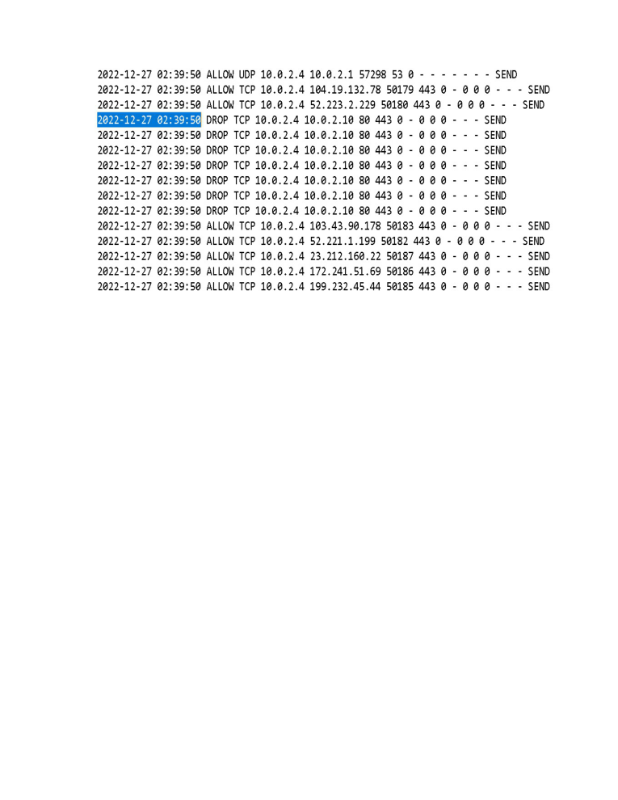

# Windows Firewall Log Analysis

> **SOC Analyst Portfolio Case Study** — network security monitoring and log analysis

### 🧰 Tools & Technologies
  

## 🎯 Investigation objective
Analyzed Windows Firewall logs to identify reconnaissance patterns and suspicious connection activity, then correlated the network indicators with timestamps and destination ports.

## 🔎 What I found
- Identified a **10-entry port-scanning sequence** from `10.0.2.15`.
- Observed destination ports **135, 21, 445, 139 and 80** in the scan sequence.
- Identified an **8-entry connection attempt to port 80** from `10.0.2.10`.
- Correlated source IPs, destination ports, timestamps and packet sizes to support the assessment.

## 🧠 Analyst thinking
The useful signal was the pattern rather than a single firewall entry. Repeated attempts across multiple service ports are more meaningful when viewed together as a possible reconnaissance sequence.

## 📸 Evidence
Selected screenshots from the original project submission are included below.

## 💡 Skills demonstrated
**Windows Firewall • Log analysis • Network reconnaissance detection • TCP/IP • Timestamp correlation • Source/destination analysis • Security reporting**

## Scope & ethics
Completed in a controlled lab / educational environment using supplied or simulated network data. No unauthorised systems were targeted.
