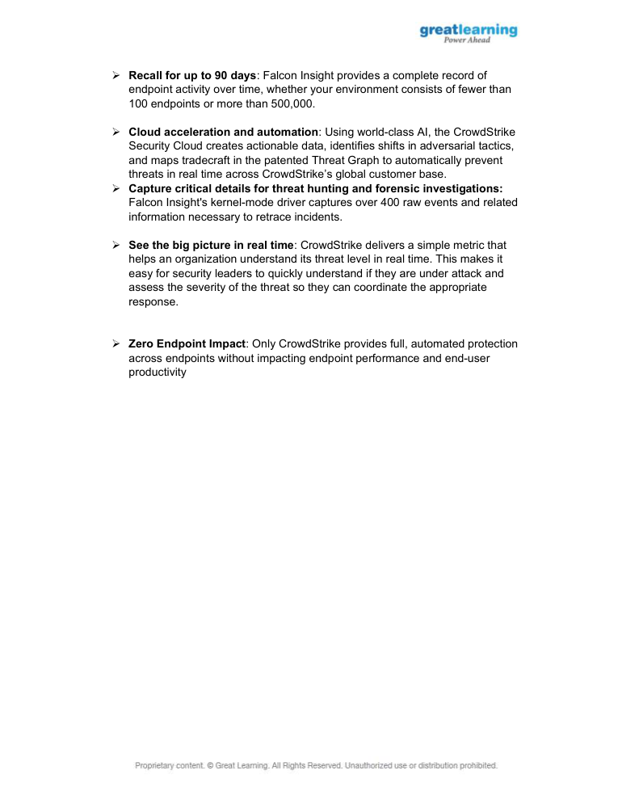

# EDR Product Evaluation

> **SOC Analyst Portfolio Case Study** — endpoint detection and response evaluation

### 🧰 Tools & Technologies
  

## 🎯 Evaluation objective
Compared three EDR products against operational security requirements and evaluated capabilities relevant to SOC operations.

## 🔎 What I evaluated
- Compared **network containment, forensic evidence and cloud sandbox** capabilities.
- Evaluated Zero Trust alignment, managed-security support, deployment and integration considerations.
- Compared the project-specified Gartner ratings, capability and support scores.
- Selected **CrowdStrike Falcon Insight** as the best fit for the stated project scenario based on the supplied requirements.

## 🧠 Analyst thinking
The exercise was less about picking a famous product and more about matching security capabilities to operational requirements — especially **containment, investigation, evidence and support**.

## 📸 Evidence
Selected screenshots from the original project submission are included below.

## 💡 Skills demonstrated
**EDR evaluation • Endpoint security • Detection & response • Containment • Forensic evidence • Security architecture • Vendor comparison**

## Scope & ethics
Completed as an educational product-evaluation exercise using the supplied scenario and requirements.
