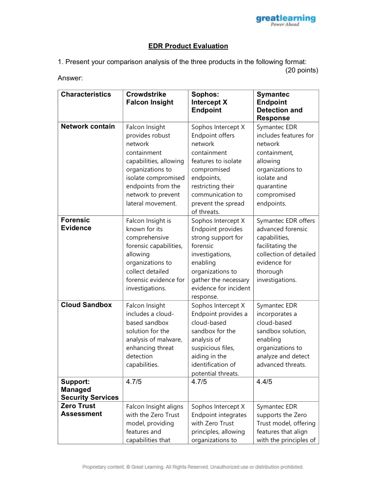
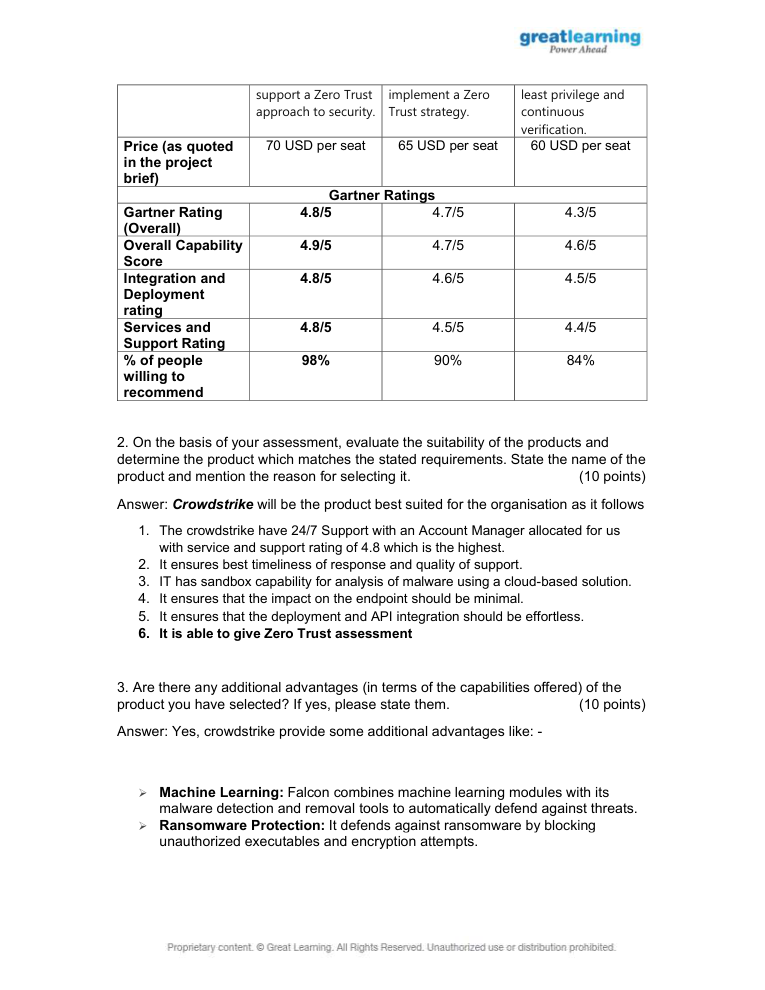

# EDR Product Evaluation

> **SOC Analyst Portfolio Project**

## Overview
Compared three EDR products against operational security requirements and evaluated capabilities relevant to SOC operations.

**Category:** Endpoint Detection & Response  
**Tools / Concepts:** CrowdStrike Falcon Insight / Sophos Intercept X / Symantec EDR

## What I Did
- Compared network containment, forensic evidence and cloud sandbox capabilities.
- Evaluated Zero Trust alignment, managed security support, deployment and integration considerations.
- Compared project-specified Gartner ratings, capability and support scores.
- Selected CrowdStrike Falcon Insight as the best fit for the project scenario based on the stated requirements.

## Evidence
The screenshots below were extracted/rendered from the original project submission. Public-facing evidence has been kept focused on the security-analysis workflow; credential values are redacted where appropriate.

## Analyst Takeaways
- Focused on evidence-driven analysis rather than assumptions.
- Documented findings in an analyst/reporting format suitable for SOC workflows.
- Connected technical observations to security impact, prioritization or remediation where applicable.

## Scope & Ethics
This project was completed in a controlled lab / educational environment using supplied datasets, simulated systems or public threat-intelligence material as described by the original submission. No unauthorized systems were targeted.
