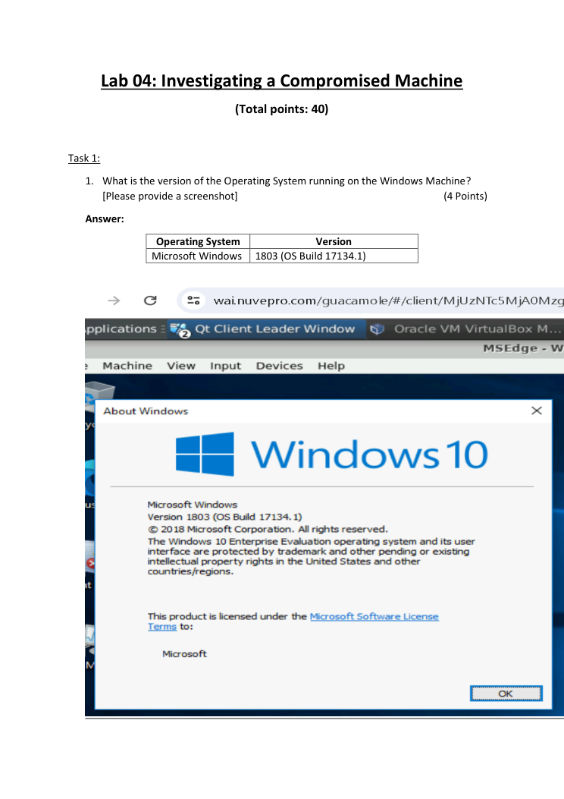
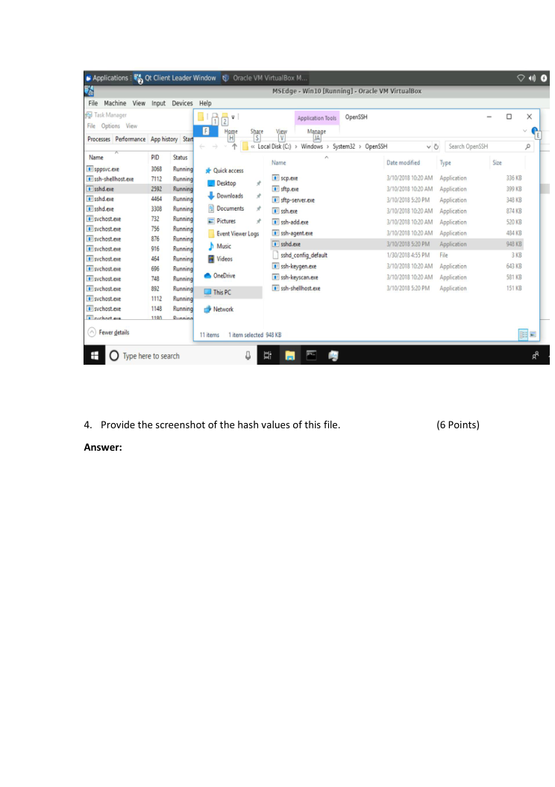
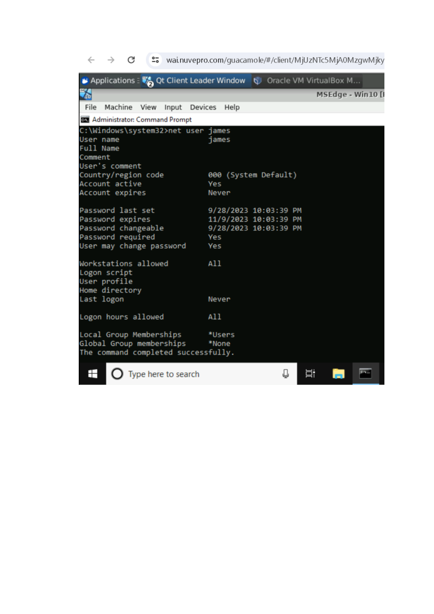

# Investigating a Compromised Windows Machine

> **SOC Analyst Portfolio Case Study** — Windows incident investigation

### 🧰 Tools & Technologies
  

## 🎯 Investigation objective
Investigated a simulated compromised Windows endpoint by correlating authentication, privilege, audit-log and network activity to understand what happened and identify useful next investigative steps.

## 🔎 What I investigated
- Reviewed suspicious failed-login activity followed by a successful login inconsistent with the expected user schedule.
- Identified deletion of audit logs as a potential **defense-evasion** indicator.
- Investigated `sshd.exe` activity and considered whether the behaviour could represent command-and-control communication.
- Documented follow-up questions around privilege escalation, first C2 communication and additional malicious files.

## 🧠 Analyst thinking
The focus was not simply to label an event as malicious. I worked from the available evidence, connected related events and documented what would need to be validated next by a SOC/IR team.

## 📸 Evidence
Selected screenshots from the original project submission are included below.

## 💡 Skills demonstrated
**Windows security • Authentication analysis • Event-log investigation • Defense-evasion analysis • Process investigation • C2 hypothesis building • Incident documentation**

## Scope & ethics
Completed in a controlled lab / educational environment using supplied or simulated material. No unauthorised systems were targeted.
