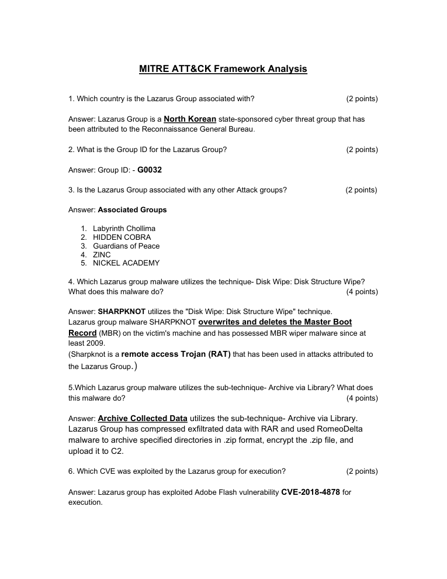
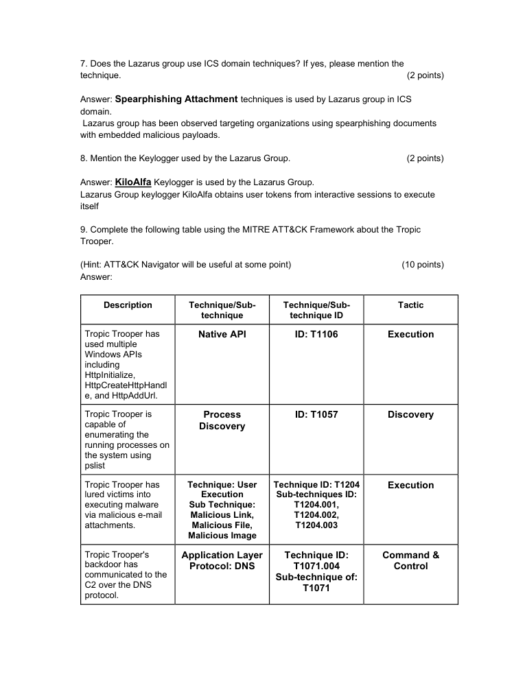

# MITRE ATT&CK Framework Analysis

> **SOC Analyst Portfolio Case Study** — threat intelligence and adversary TTP mapping

### 🧰 Tools & Technologies
  

## 🎯 Investigation objective
Mapped threat-actor and malware behaviours to MITRE ATT&CK tactics, techniques and sub-techniques to make adversary behaviour easier to understand from a detection perspective.

## 🔎 What I investigated
- Analysed **Lazarus Group** activity and its ATT&CK-related behaviours.
- Mapped **Tropic Trooper** behaviours including **Native API (T1106), Process Discovery (T1057) and User Execution (T1204)**.
- Documented DNS-based command-and-control behaviour and related ATT&CK mapping.
- Connected adversary behaviours with detection and mitigation considerations.

## 🧠 Analyst thinking
Threat intelligence becomes more useful when it can be translated into something a SOC can act on. ATT&CK provides a common language for describing **what the adversary did** and where defenders can look for evidence.

## 📸 Evidence
Selected screenshots from the original project submission are included below.

## 💡 Skills demonstrated
**MITRE ATT&CK • Threat intelligence • TTP mapping • Adversary research • DNS C2 analysis • Detection thinking • Security documentation**

## Scope & ethics
Based on supplied/public threat-intelligence material for educational analysis. No unauthorised systems were targeted.
