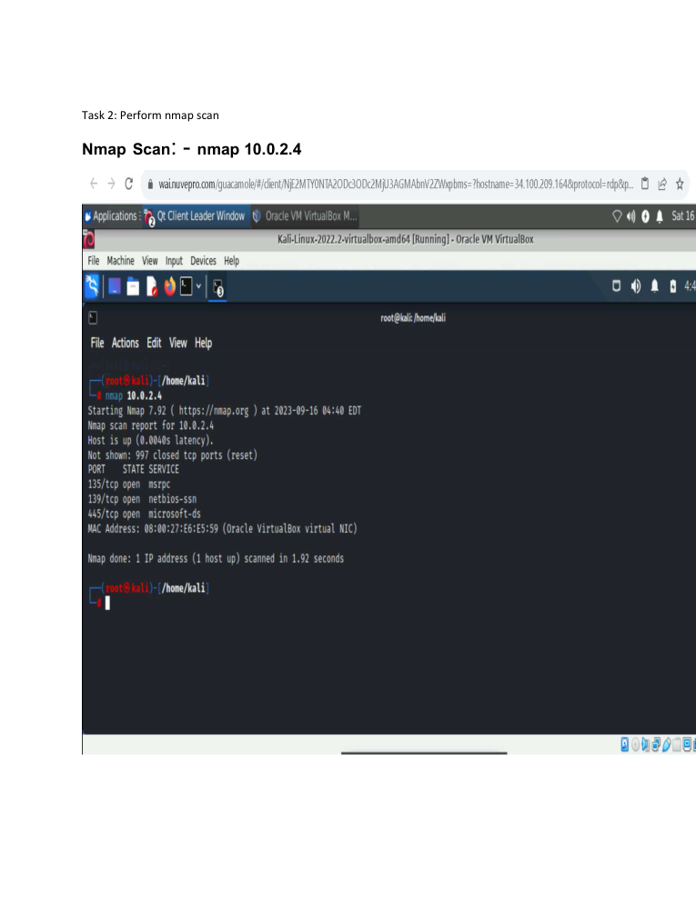
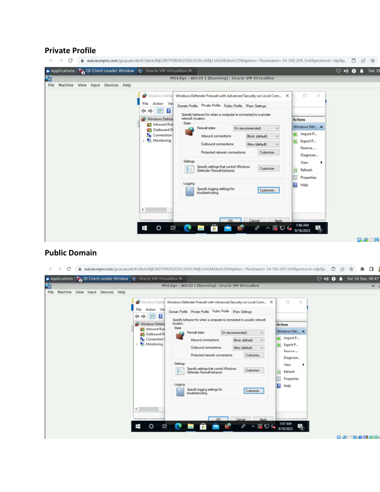
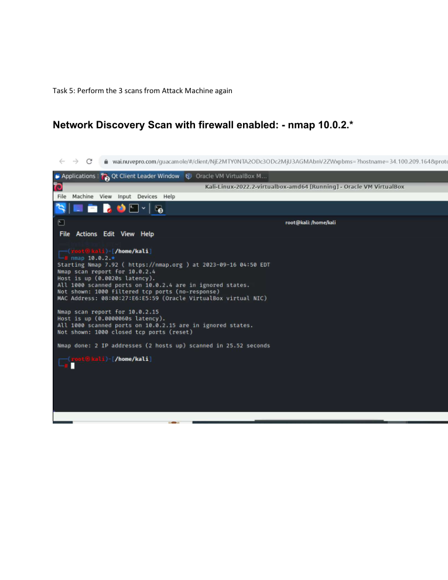

# Nmap Network Scanning & Windows Firewall Lab

> **SOC Analyst Portfolio Case Study** — reconnaissance and defensive controls

### 🧰 Tools & Technologies
  

## 🎯 Investigation objective
Performed network discovery and service-scanning exercises, then compared the observable results before and after Windows Firewall configuration.

## 🔎 What I did
- Performed network-discovery scans across the lab subnet.
- Ran Nmap scans with the firewall enabled and compared the observable results.
- Reviewed Windows Firewall logs to understand blocked traffic and scan behaviour.
- Connected reconnaissance activity with the defensive control that influenced the result.

## 🧠 Analyst thinking
The key lesson was understanding both sides of the event: **what an attacker can observe during reconnaissance and what a defensive control changes in the telemetry.**

## 📸 Evidence
Selected screenshots from the original project submission are included below.

## 💡 Skills demonstrated
**Nmap • Network discovery • Service scanning • Windows Firewall • Reconnaissance analysis • Defensive monitoring • Network security**

## Scope & ethics
Completed only against controlled lab systems and supplied/simulated network environments. No unauthorised systems were targeted.
