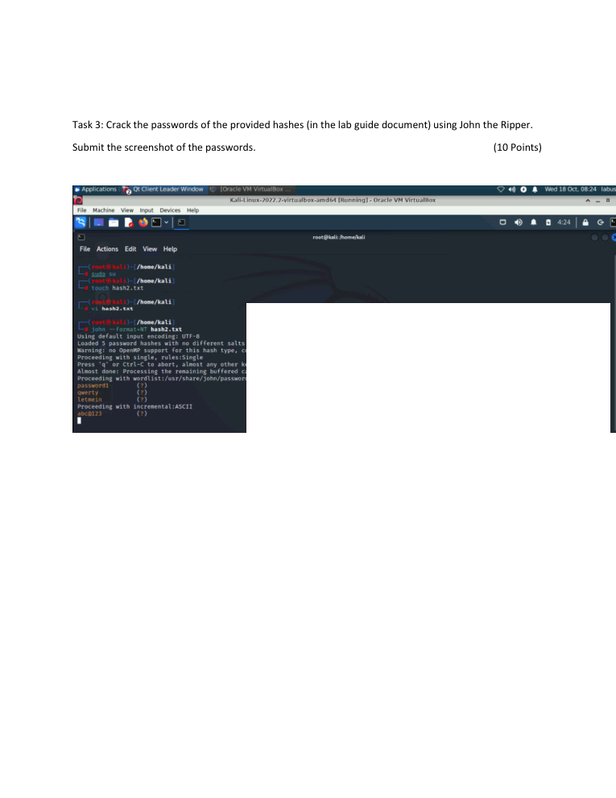

# Password Security & Hash Cracking Lab

> **SOC Analyst Portfolio Case Study** — credential security in a controlled lab

### 🧰 Tools & Technologies
   

## 🎯 Lab objective
Performed controlled password-security exercises against lab credentials to understand NTLM authentication and password-auditing workflows.

## 🔎 What I did
- Extracted and analysed NTLM password hashes in a controlled Windows lab.
- Performed NTLM hash-cracking exercises with **Ophcrack on Kali Linux**.
- Used **John the Ripper** against supplied lab hashes.
- Used L0phtCrack as part of the password-auditing exercise.

## 🔐 Public evidence note
Recovered password values are **intentionally redacted** from the public evidence. The purpose of the repository is to demonstrate the investigation methodology and security concepts, not to publish credentials.

## 🧠 Analyst thinking
Understanding how weak credentials can be recovered from hashes reinforces why strong authentication, password policy, credential protection and secure handling of authentication material matter to a defensive team.

## 📸 Evidence
Selected screenshots from the original project submission are included below.

## 💡 Skills demonstrated
**NTLM • Hash analysis • Password auditing • Credential security • Windows authentication • Linux security tooling • Evidence handling**

## Scope & ethics
Performed only against supplied lab credentials in a controlled educational environment. No real user credentials were targeted or published.
