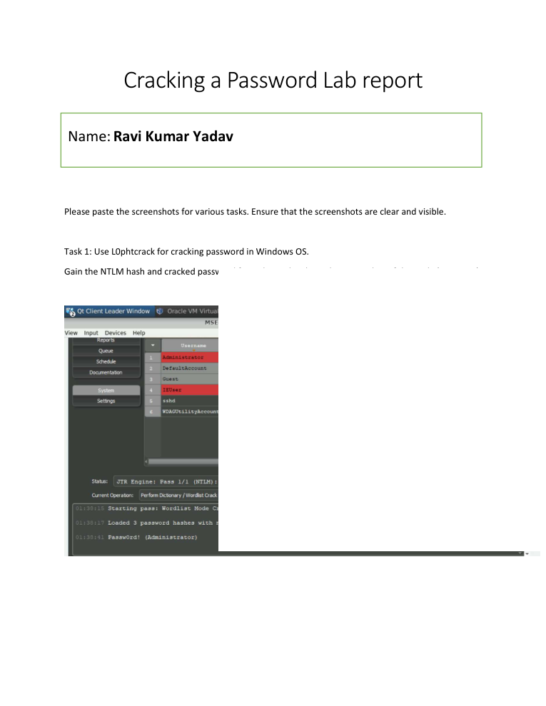
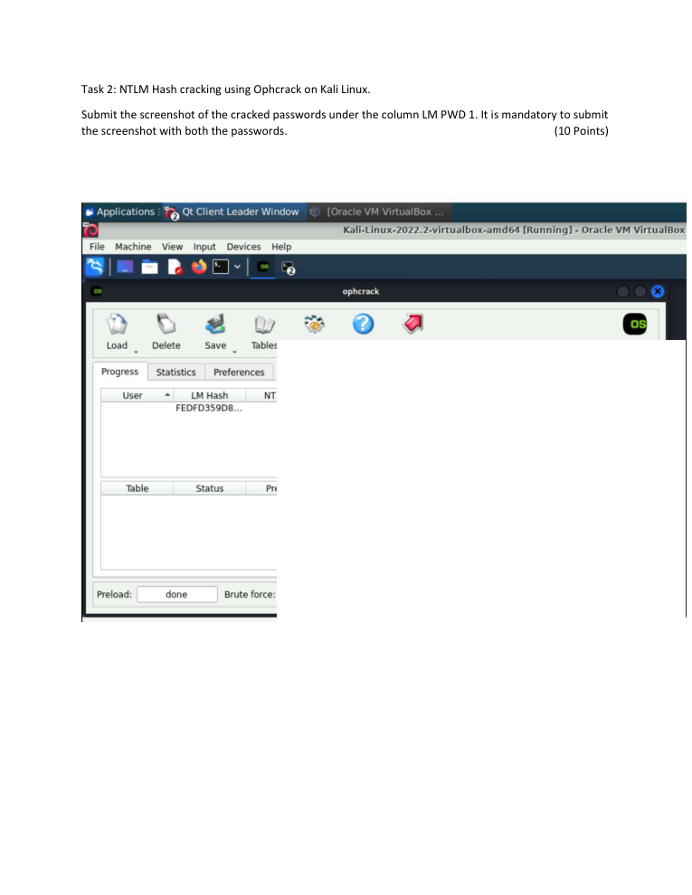

# Password Security & Hash Cracking Lab

> **SOC Analyst Portfolio Project**

## Overview
Performed controlled password-security exercises against lab credentials using multiple password-auditing tools.

**Category:** Credential security / Windows & Linux  
**Tools / Concepts:** L0phtCrack / Ophcrack / John the Ripper / NTLM

## What I Did
- Extracted and analyzed NTLM password hashes in a controlled Windows lab.
- Performed NTLM hash cracking with Ophcrack on Kali Linux.
- Used John the Ripper against provided lab hashes.
- Evidence images intentionally redact recovered password values before public publication.

## Evidence
The screenshots below were extracted/rendered from the original project submission. Public-facing evidence has been kept focused on the security-analysis workflow; credential values are redacted where appropriate.

## Analyst Takeaways
- Focused on evidence-driven analysis rather than assumptions.
- Documented findings in an analyst/reporting format suitable for SOC workflows.
- Connected technical observations to security impact, prioritization or remediation where applicable.

## Scope & Ethics
This project was completed in a controlled lab / educational environment using supplied datasets, simulated systems or public threat-intelligence material as described by the original submission. No unauthorized systems were targeted.
