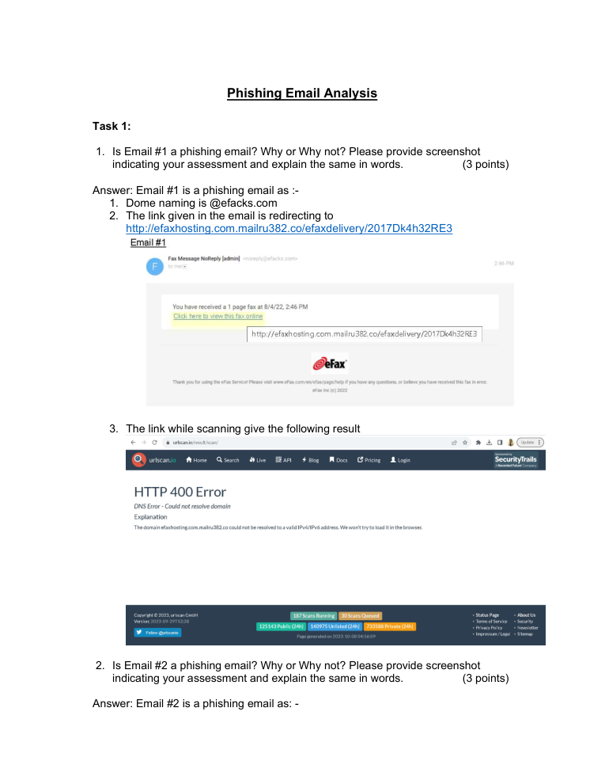
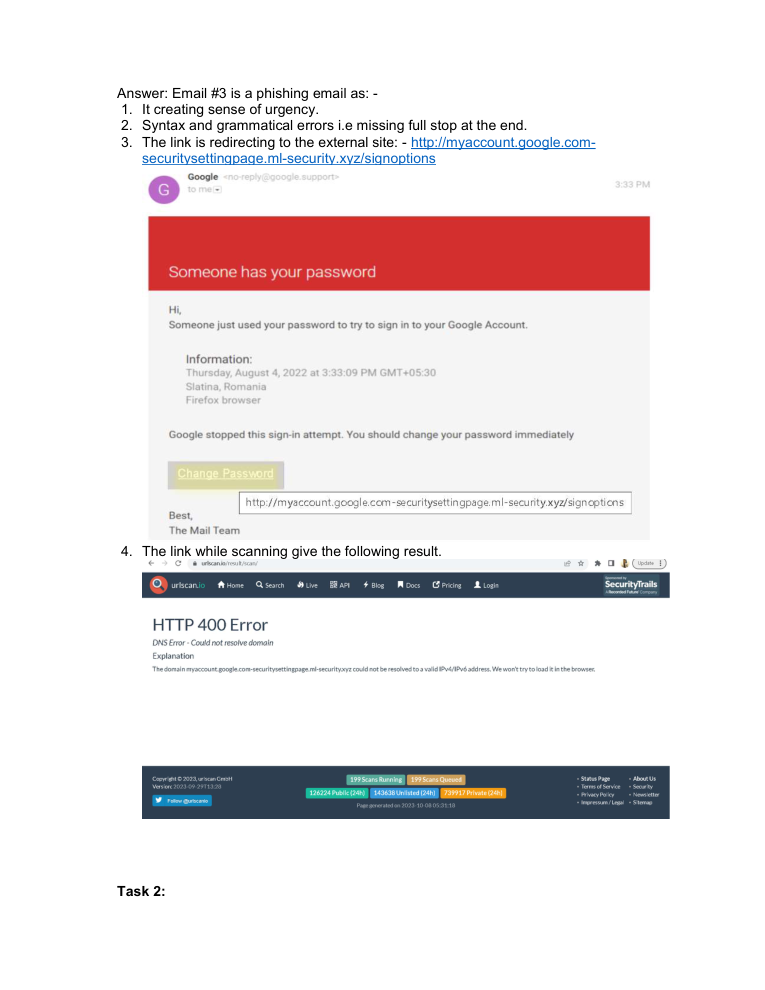
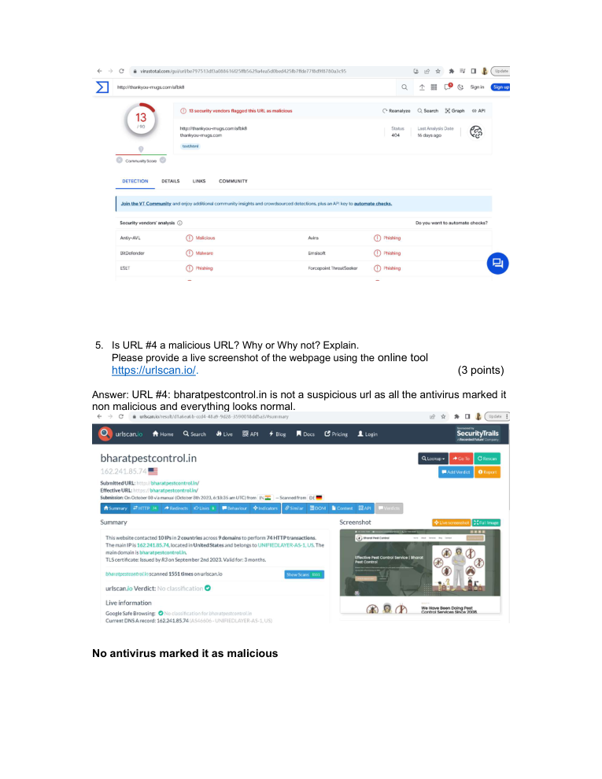

# Phishing Email Analysis

> **SOC Analyst Portfolio Case Study** — email threat analysis and IOC reasoning

### 🧰 Tools & Technologies
  

## 🎯 Investigation objective
Analyzed email samples to distinguish legitimate messages from phishing attempts using message characteristics, hyperlink evidence and destination behaviour.

## 🔎 What I did
- Reviewed sender and message characteristics for phishing indicators.
- Analysed hyperlinks and destination behaviour to assess authenticity.
- Documented the reasoning and evidence supporting each assessment.
- Validated a legitimate Dropbox-related message by checking its link destination during the lab exercise.

## 🧠 Analyst thinking
A suspicious-looking email is not automatically malicious. The goal was to **validate the evidence** — sender context, message content, URL behaviour and destination — before deciding how the message should be handled.

## 📸 Evidence
Selected screenshots from the original project submission are included below.

## 💡 Skills demonstrated
**Phishing triage • Email analysis • URL analysis • IOC identification • Evidence-based decision making • Security reporting**

## Scope & ethics
Completed as a controlled educational exercise using supplied email samples. No real-world targets were contacted or compromised.
