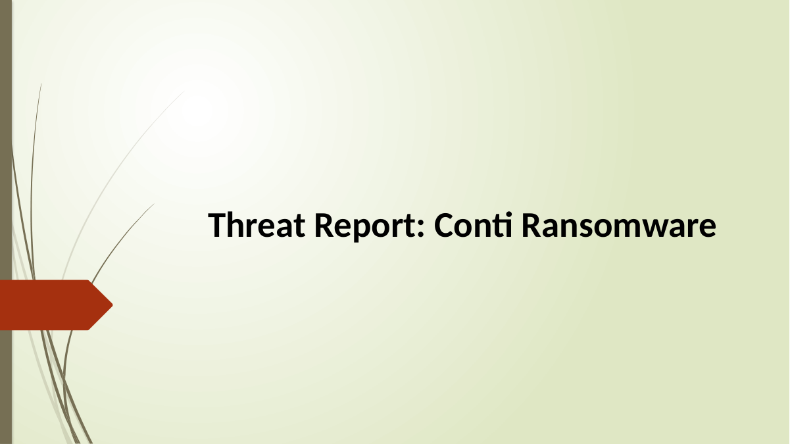
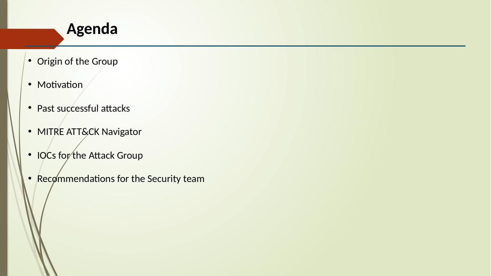
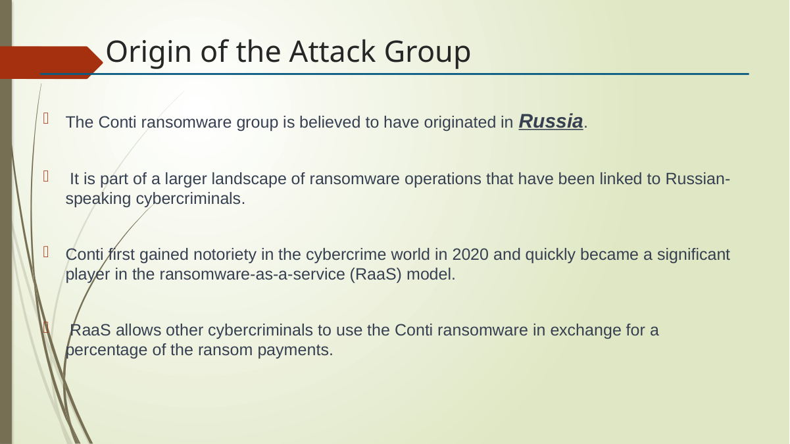

# Conti Ransomware Threat Report

> **SOC Analyst Portfolio Case Study** — ransomware threat intelligence and IOC analysis

### 🧰 Tools & Technologies
  

## 🎯 Investigation objective
Prepared a threat report covering Conti ransomware operations, motivation, notable attacks, indicators of compromise and defensive recommendations.

## 🔎 What I covered
- Documented Conti as a **ransomware-as-a-service** operation and summarised its financially motivated model.
- Reviewed notable attacks including **Ireland HSE, Broward County Public Schools and Ireland Department of Health**.
- Organised IOC categories including file hashes, IP addresses, domains and email addresses.
- Developed defensive recommendations covering patching, access controls, email security, backups, segmentation and awareness.

## 🧠 Analyst thinking
A threat report should help a defender answer two questions quickly: **what should I look for, and what can I do about it?** The report therefore connects adversary context and IOCs with practical defensive actions.

## 📸 Evidence
Selected screenshots from the original project submission are included below.

## 💡 Skills demonstrated
**Threat intelligence • IOC analysis • Ransomware research • Defensive recommendations • ATT&CK context • Security reporting**

## Scope & ethics
Based on supplied/public threat-intelligence material for educational analysis. No unauthorised systems were targeted.
