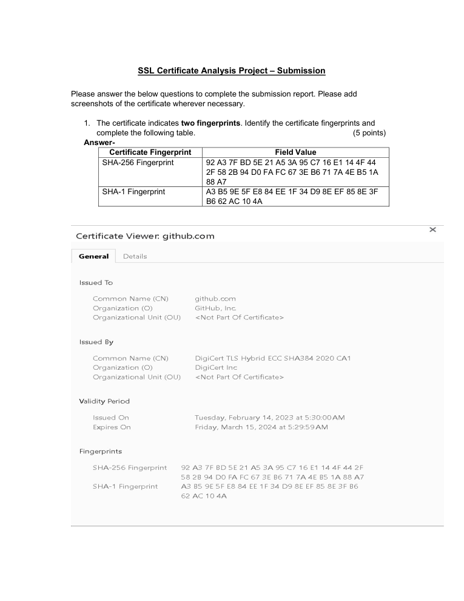
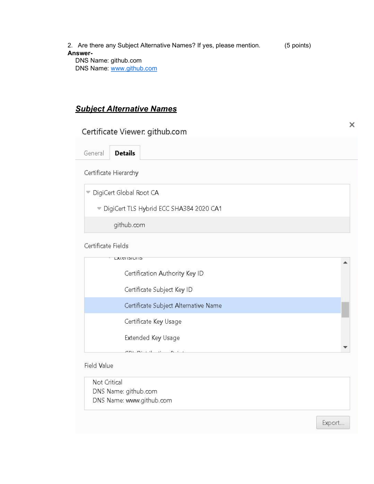
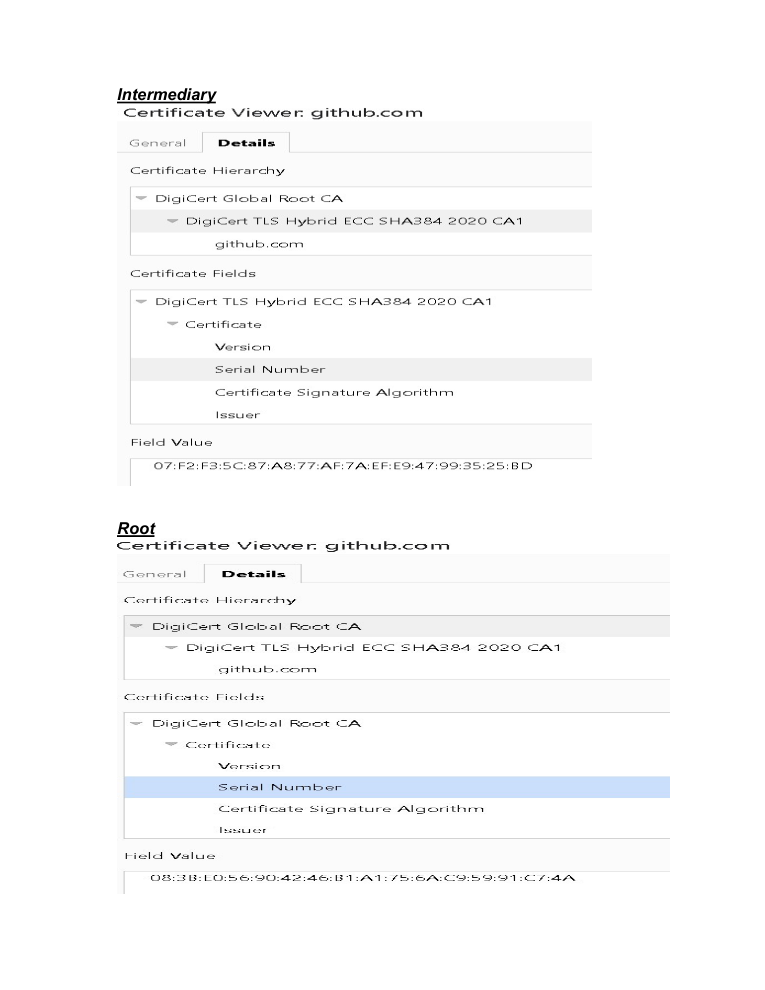

# SSL/TLS Certificate Analysis

> **SOC Analyst Portfolio Case Study** — certificate identity and trust analysis

### 🧰 Tools & Technologies
  

## 🎯 Investigation objective
Analysed certificate fields, fingerprints and Subject Alternative Names to understand certificate identity and trust information.

## 🔎 What I investigated
- Documented **SHA-256 and SHA-1 certificate fingerprints**.
- Identified Subject Alternative Names including **github.com** and **www.github.com**.
- Reviewed certificate metadata and supporting evidence from the supplied certificate-analysis exercise.

## 🧠 Analyst thinking
Certificate analysis helps a security analyst validate identity and understand the trust chain behind encrypted communication. The important part is knowing which certificate fields provide useful evidence and what they actually prove.

## 📸 Evidence
Selected screenshots from the original project submission are included below.

## 💡 Skills demonstrated
**TLS • X.509 • Certificate analysis • SHA-256 • SHA-1 • SAN analysis • Security evidence documentation**

## Scope & ethics
Completed using the supplied certificate-analysis material for educational purposes.
