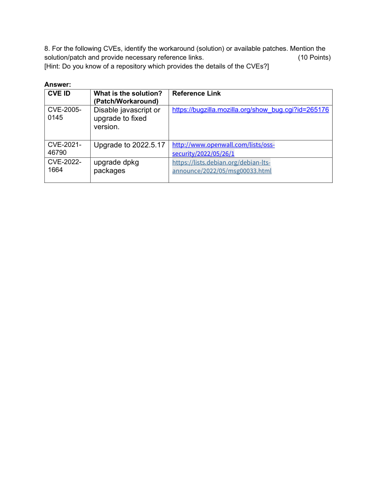

# Vulnerability Management Data Analysis

> **SOC Analyst Portfolio Case Study** — asset exposure and vulnerability prioritisation

### 🧰 Tools & Technologies
  

## 🎯 Investigation objective
Analysed vulnerability-management data to identify high-risk endpoints, vulnerable assets and high-severity CVE exposure, then used the results to prioritise where attention should go first.

## 🔎 What I found
- Identified the four assets with the highest vulnerability counts: **S01-0609 (1,641), S01-1237 (1,629), S01-0724 (1,618) and S01-1171 (1,617)**.
- Identified **S01-0611** as the highest-vulnerability Windows workstation with **1,475 vulnerabilities**.
- Analysed **337 connected servers** and **470 connected workstations**.
- Reviewed CVEs with severity greater than 9 and considered endpoint impact.

## 🧠 Analyst thinking
The exercise was about moving beyond a large spreadsheet and asking: **which assets deserve attention first, and why?** Asset concentration, vulnerability count and severity provide a practical starting point for remediation prioritisation.

## 📸 Evidence
Selected screenshots from the original project submission are included below.

## 💡 Skills demonstrated
**Excel analysis • Vulnerability management • CVE analysis • Asset prioritisation • Risk assessment • Data interpretation • Security reporting**

## Scope & ethics
Completed using supplied vulnerability-management data for educational analysis. No unauthorised systems were assessed.
