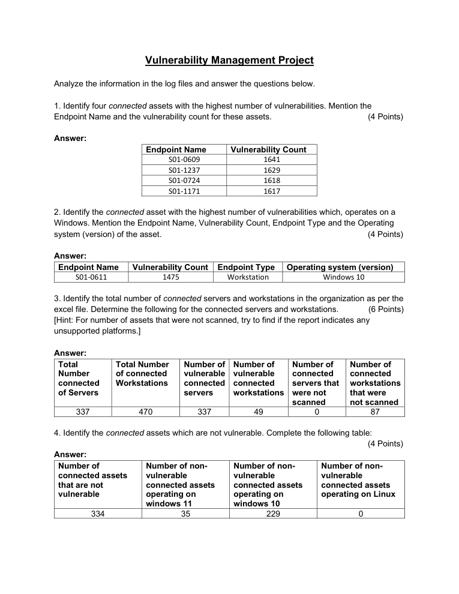
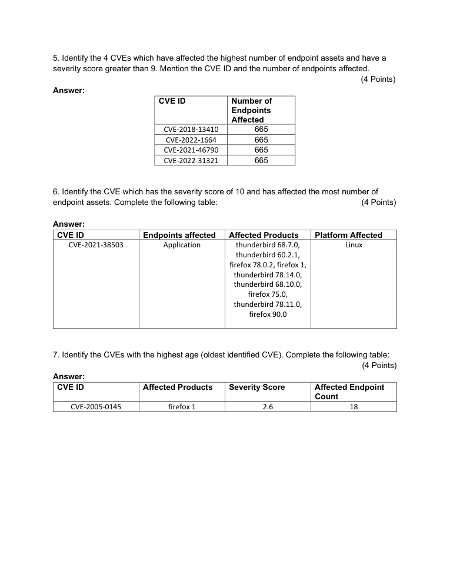

# Vulnerability Management Data Analysis

> **SOC Analyst Portfolio Project**

## Overview
Analyzed vulnerability-management data to identify high-risk endpoints, vulnerable assets, and high-severity CVE exposure.

**Category:** Vulnerability management / asset risk analysis  
**Tools / Concepts:** Excel / vulnerability-management dataset / CVE analysis

## What I Did
- Identified the four assets with the highest vulnerability counts: S01-0609 (1,641), S01-1237 (1,629), S01-0724 (1,618), and S01-1171 (1,617).
- Identified S01-0611 as the highest-vulnerability Windows workstation with 1,475 vulnerabilities.
- Analyzed 337 connected servers and 470 connected workstations and assessed vulnerable/non-vulnerable assets.
- Reviewed CVEs with severity greater than 9 and endpoint impact.

## Evidence
The screenshots below were extracted/rendered from the original project submission. Public-facing evidence has been kept focused on the security-analysis workflow; credential values are redacted where appropriate.

## Analyst Takeaways
- Focused on evidence-driven analysis rather than assumptions.
- Documented findings in an analyst/reporting format suitable for SOC workflows.
- Connected technical observations to security impact, prioritization or remediation where applicable.

## Scope & Ethics
This project was completed in a controlled lab / educational environment using supplied datasets, simulated systems or public threat-intelligence material as described by the original submission. No unauthorized systems were targeted.
