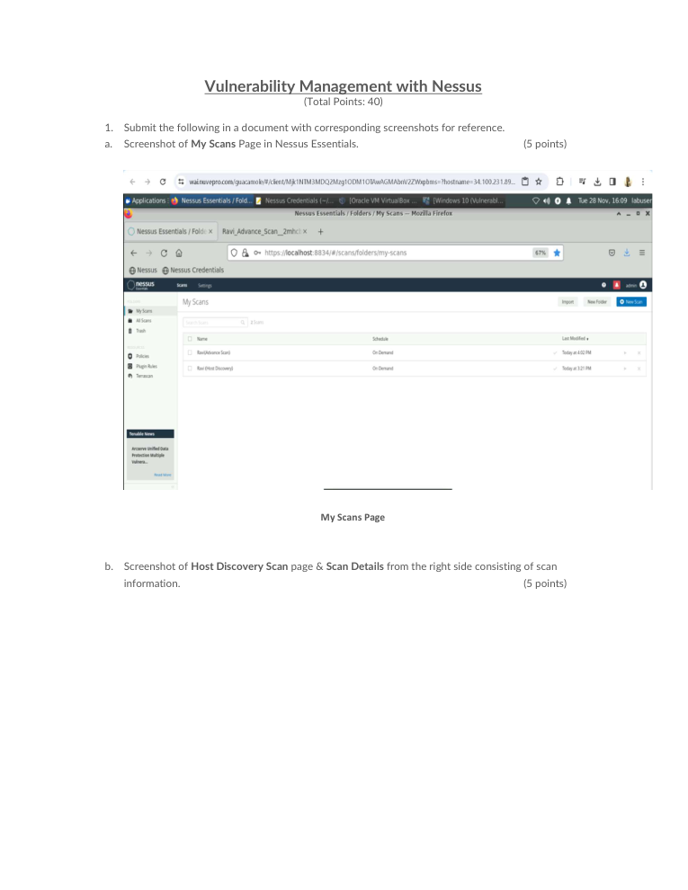
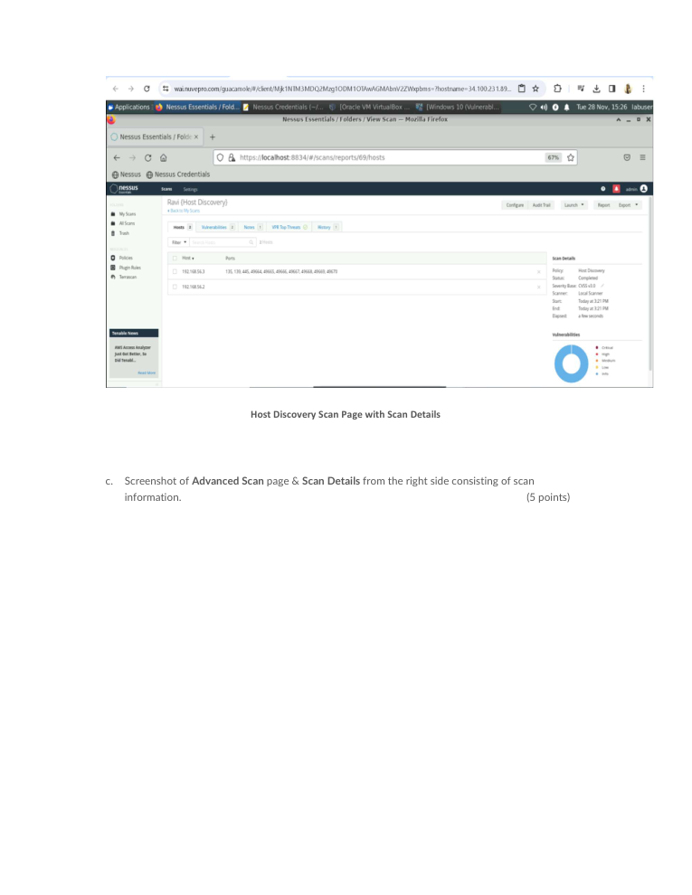
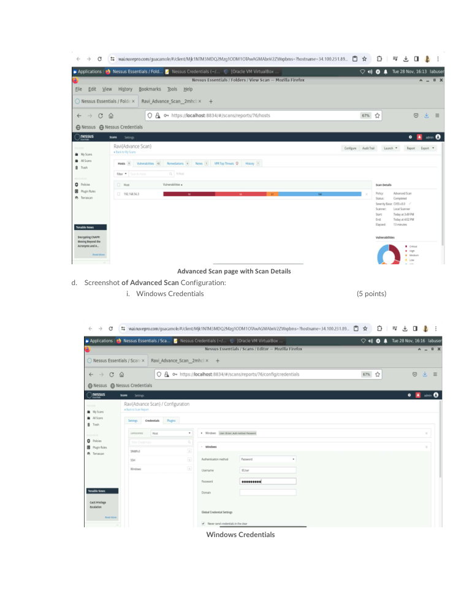

# Vulnerability Management with Nessus

> **SOC Analyst Portfolio Case Study** — vulnerability assessment and risk prioritisation

### 🧰 Tools & Technologies
  

## 🎯 Investigation objective
Performed host discovery and advanced vulnerability scanning in Nessus Essentials, including Windows credentialed-scan configuration and result analysis.

## 🔎 What I found
The assessment produced **329 findings**:

| Severity | Findings |
|---|---:|
| 🔴 Critical | **98** |
| 🟠 High | **96** |
| 🟡 Medium | **21** |
| ⚪ Low | **0** |
| ℹ️ Informational | **114** |

I also configured Windows credentials for an authenticated vulnerability assessment and used severity-based results to support prioritisation.

## 🧠 Analyst thinking
A vulnerability scan is most useful when the output becomes a prioritised action list. I focused on severity, affected assets and the difference between informational data and issues that require remediation attention.

## 📸 Evidence
Selected screenshots from the original project submission are included below.

## 💡 Skills demonstrated
**Nessus • Authenticated scanning • Vulnerability assessment • CVE analysis • Severity prioritisation • Windows security • Risk reporting**

## Scope & ethics
Completed in a controlled lab / educational environment using supplied or simulated systems. No unauthorised systems were scanned.
