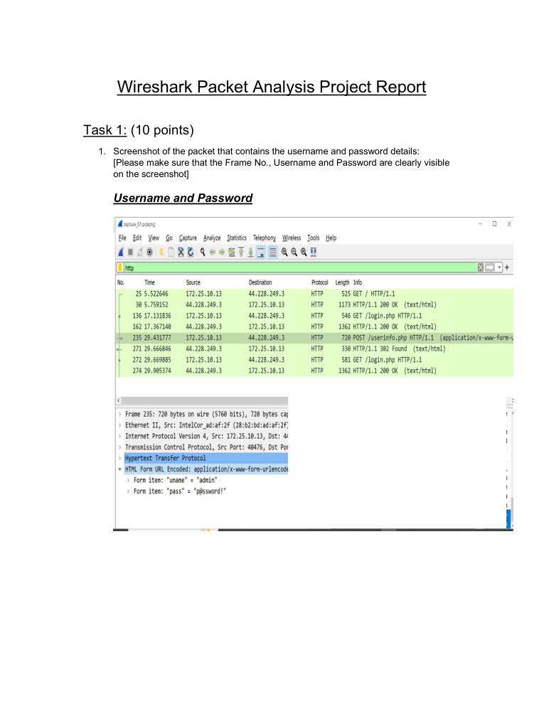
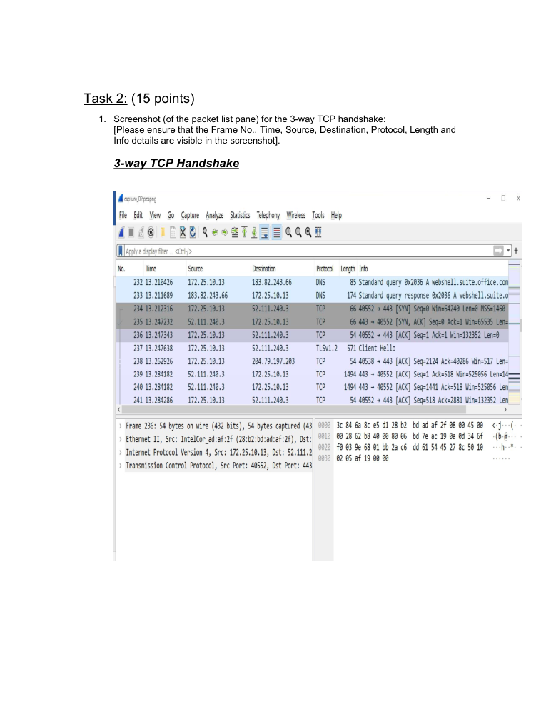
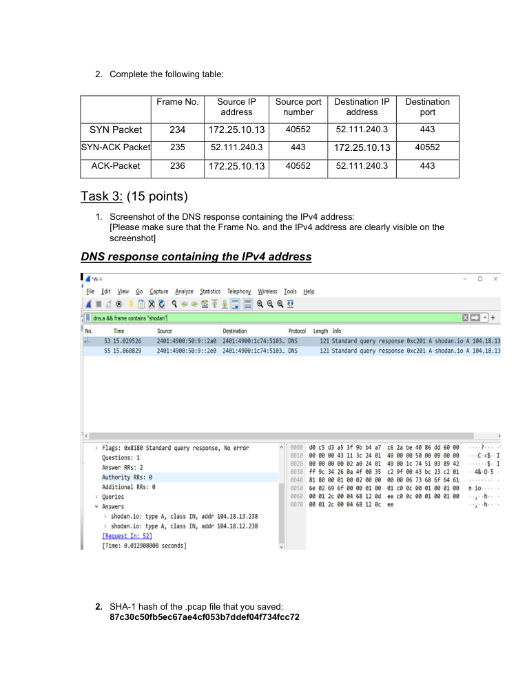

# Wireshark Packet Analysis

> **SOC Analyst Portfolio Case Study** — packet-level network investigation

### 🧰 Tools & Technologies
  

## 🎯 Investigation objective
Performed packet-level analysis of a supplied PCAP to investigate application traffic, TCP connection establishment and DNS activity, using frame-level evidence to support the findings.

## 🔎 What I investigated
- Inspected HTTP traffic relevant to credential exposure in a controlled lab.
- Analyzed the **TCP three-way handshake** and documented source/destination IPs and ports.
- Investigated DNS response traffic and documented the SHA-1 hash of the saved PCAP.
- Used individual packet/frame evidence rather than relying only on high-level summaries.

## 🧠 Analyst thinking
Packet analysis is about reconstructing the conversation: who communicated, over which protocol, on what port, and what the traffic actually contained. This exercise helped turn raw packets into an investigation narrative.

## 📸 Evidence
Selected screenshots from the original project submission are included below. Public-facing evidence is focused on the investigation workflow and sensitive credential values are redacted.

## 💡 Skills demonstrated
**Wireshark • PCAP analysis • TCP/IP • DNS • HTTP • Packet inspection • Evidence correlation • Network investigation**

## Scope & ethics
Completed in a controlled lab / educational environment using supplied packet-capture data. No unauthorised systems were targeted.
