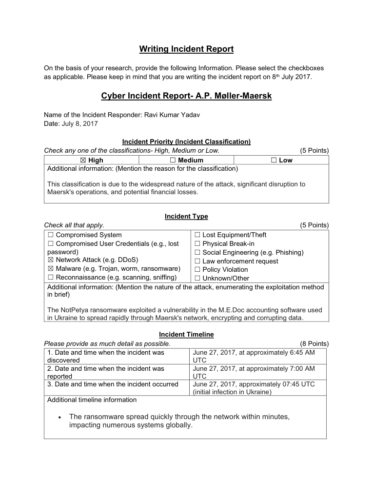
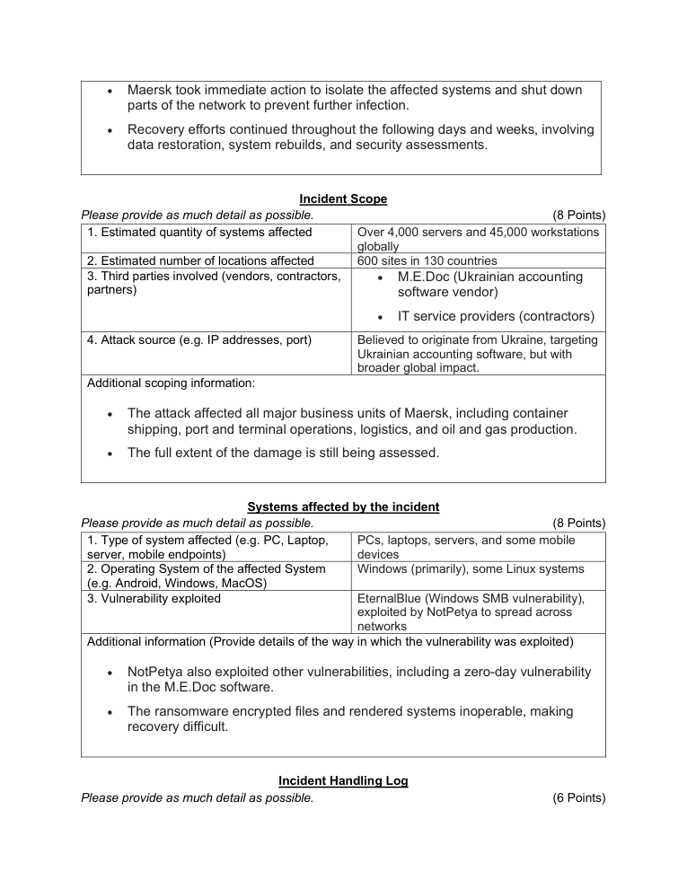
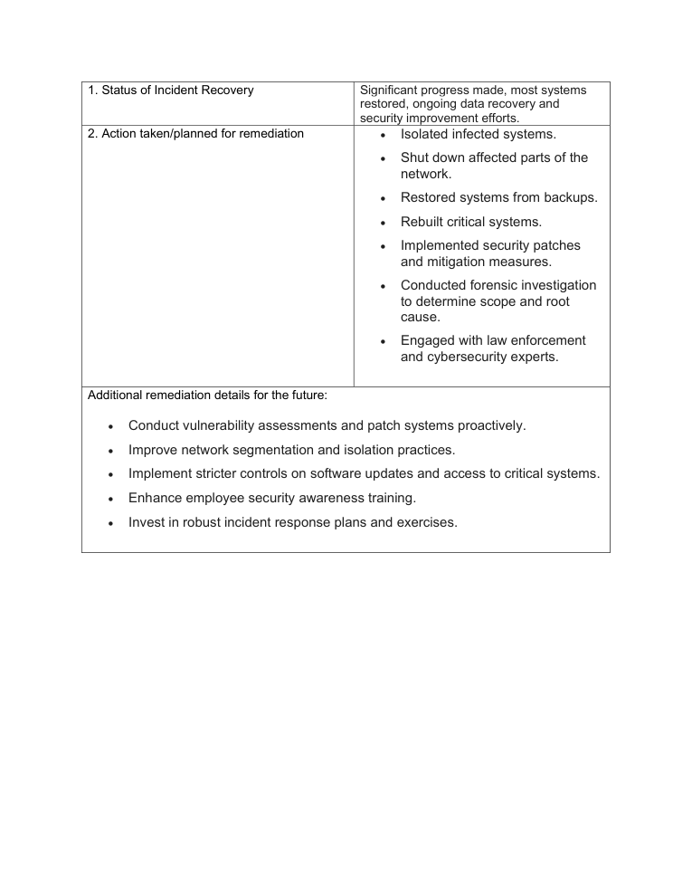

# NotPetya Incident Response Report – A.P. Møller-Maersk

> **SOC Analyst Portfolio Case Study** — incident response and recovery

### 🧰 Tools & Technologies
  

## 🎯 Investigation objective
Produced an analyst-style incident report covering classification, timeline, scope, affected systems and remediation for the NotPetya incident scenario.

## 🔎 What I covered
- Classified the event as a **high-priority network attack and malware incident**.
- Documented the incident timeline, global scope and affected infrastructure.
- Recorded containment, isolation, restoration, rebuilding, patching and forensic-investigation actions.
- Recommended proactive vulnerability management, segmentation, access controls, awareness training and incident-response exercises.

## 🧠 Analyst thinking
Incident response is more than containment. A useful report preserves the timeline, explains the business impact and shows how the organisation moves from **contain → investigate → recover → reduce recurrence risk**.

## 📸 Evidence
Selected screenshots from the original project submission are included below.

## 💡 Skills demonstrated
**Incident classification • Timeline building • Containment • Recovery • Remediation • Forensic thinking • Incident reporting**

## Scope & ethics
Based on the supplied incident scenario and public information for educational analysis. No unauthorised systems were targeted.
